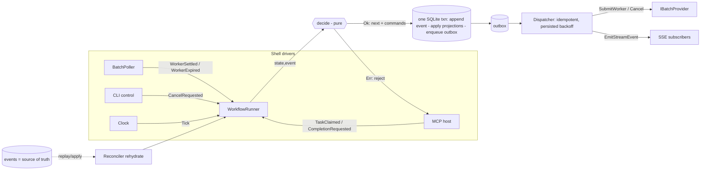

# CrockCode — Implementation Plan

## Context

**CrockCode** (Crock as in crockpot — slow cooking) is a headless-first CLI coding agent that runs coding work over **Anthropic's Message Batches API + the MCP connector** to get ~50% cheaper inference, accepting high latency (minutes–hours) in exchange. The bet: do the work when it's cheapest, even if it's slower overall.

The architecture hinges on one confirmed-but-unusual capability: **the Batch API supports the `mcp_servers` connector**, and *the batch worker runs the same server-side agentic loop as the sync Messages API* (Anthropic docs, beta header `mcp-client-2025-11-20`). So **one batch request = one full agent run**: the model fetches a task, then drives many sequential MCP tool calls (read/edit/grep/bash…) that Anthropic's infra executes by calling *our* public MCP endpoint over HTTPS, continuing until the model stops.

This **inverts normal control flow**: CrockCode is not "the agent" — it is (a) a passive **MCP tool server** the model reaches into, plus (b) a **batch lifecycle + pool manager**. Every design choice follows from that inversion.

### Goals
- Headless-first CLI (`crock -p "..."`), Claude-Code/Codex-style `--output-format text|json|stream-json`.
- A shared **task queue**; generic batch "worker" requests (system prompt: *"Fetch your first task from MCP"*) that pull tasks at execution time.
- A **pool** of pre-submitted in-flight workers so batch capacity is grabbed as it frees up.
- Queue + pool **shared across multiple CrockCode instances**, with collective pool-size control (coordinator daemon + thin CLI clients).
- Reuse server-side tools (web_search, web_fetch, code_execution) — do **not** reimplement them in MCP.
- Provider seam for **future OpenAI** batch+MCP support.

### Key product decisions (from the user)
- **Working-directory model, no git worktrees.** Each instance runs in its own directory; we do *not* solve concurrent-edit-in-one-dir (same as you don't run two Claude Codes in one dir). Edits are applied **in place**; the user reviews with their own `git diff`. CrockCode does no branching/merging.
- **Concurrency = across directories, serialized within a directory — at the *task-tree* granularity.** At most one task **tree** runs per working directory; a task and its subagents share that directory and **do not lock against each other** (exactly like one Claude Code run with subagents). Unrelated trees serialize per directory; many directories run in parallel up to the global cap.
- **Command execution:** capped `Bash` (hard-capped under the MCP timeout, ~50s) **plus** the trained `Bash(run_in_background)` + background-output-retrieval pattern for long builds/tests.
- **Public ingress:** support **both** an auto-managed tunnel (cloudflared/ngrok) *and* a user-supplied stable HTTPS URL.
- Plan covers the **full phased system**; implementation starts at Phase 1.

---

## Engineering standards (cross-cutting, non-negotiable)
These shape every phase below; treat them as acceptance criteria, not aspirations.

1. **Loose coupling, provider-agnostic, contract-first.** Every external dependency and every swappable concern sits behind an interface in `CrockCode.Core`; concrete implementations live in edge projects and are wired by DI only. No domain/application code references a vendor type. The full Core contract set is specified under **Core contracts & composition** below (`IBatchProvider`, `IEventStore`/`IProjectionStore`/`IOutbox`/`IJobStore`, `ILeaseManager`, `ITunnelProvider`, `IWorkspaceResolver`, `ITokenSigner`, `IControlChannel`, `IClock`, `IIdFactory`, `IRandom`). Provider-specific quirks (beta headers, batch lifecycle words) are mapped to neutral domain concepts at the boundary, and a NetArchTest enforces that Core/Engine/Cli reference no vendor package.
2. **Functional core / imperative shell (F#-style in C#).** The domain is **immutable**: positional `record`s, `init`-only members, immutable collections (`ImmutableArray`/`ImmutableDictionary`). State changes are **pure functions returning new values** — never in-place mutation. Model variant states as closed unions (sealed `abstract record` hierarchies or a discriminated-union helper) and drive logic with exhaustive `switch` pattern-matching. Expected/transitory failures are returned as `Result<T, Error>` (an explicit `Ok|Err` union), **not** thrown; exceptions are reserved for truly exceptional/programmer errors. All I/O (SQLite, HTTP, process, tunnel, clock, randomness) is pushed to the shell behind the interfaces above so the core is deterministic and unit-testable without mocks-of-mocks.
3. **Determinism & testability.** No ambient `DateTime.Now`/`Guid.NewGuid()`/`Random` in core — inject `IClock`, an id factory, and a seedable RNG. This is also what makes the workflow engine replayable.

---

## Functional core in C# (the canonical idioms)
Every union and every `Result` below references these two patterns; they are the F#-style spine the rest of the doc assumes.

**Closed unions = sealed `abstract record` + private ctor + abstract `Match`.** This yields discriminated unions with *compile-time exhaustiveness* and zero dependencies, and serializes cleanly. The private constructor seals the hierarchy (no external subtypes); the abstract `Match` forces every call site to handle every case — adding a case changes the signature, so all matches fail to compile until updated.

```csharp
public abstract record Error
{
    private Error() { }                                  // seals the union
    public abstract T Match<T>(Func<Transient,T> transient, Func<Permanent,T> permanent);

    public sealed record Transient(string Code, string Detail, TimeSpan? RetryAfter = null) : Error
    { public override T Match<T>(Func<Transient,T> t, Func<Permanent,T> p) => t(this); }
    public sealed record Permanent(string Code, string Detail) : Error
    { public override T Match<T>(Func<Transient,T> t, Func<Permanent,T> p) => p(this); }
}
```
`Error` doubles as the **transient/permanent classifier** the resilience standard requires — classification is a Core type, not a shell detail.

**`Result<T>` over exceptions** — hand-rolled in Core (no `LanguageExt`/`ErrorOr` dependency, keeping Core clean), with LINQ for railway-oriented composition:
```csharp
public abstract record Result<T>
{
    private Result() { }
    public abstract TR Match<TR>(Func<T,TR> ok, Func<Error,TR> err);
    public sealed record Ok(T Value)  : Result<T> { public override TR Match<TR>(Func<T,TR> ok, Func<Error,TR> e) => ok(Value); }
    public sealed record Err(Error E) : Result<T> { public override TR Match<TR>(Func<T,TR> ok, Func<Error,TR> e) => e(E); }

    public Result<U> Bind<U>(Func<T,Result<U>> f)          => Match(f, e => new Result<U>.Err(e));
    public Result<U> Map<U>(Func<T,U> f)                   => Bind(x => new Result<U>.Ok(f(x)));
    public Result<U> Select<U>(Func<T,U> f)                => Map(f);            // enables `from x in r ...`
    public Result<V> SelectMany<U,V>(Func<T,Result<U>> f, Func<T,U,V> g) => Bind(x => f(x).Map(u => g(x,u)));
}
```
Exceptions are reserved for programmer errors; the catch-all arm in any internal switch is `_ => throw new UnreachableException()`.

**Library choice:** hand-rolled sealed hierarchies are the standard idiom across Core (true exhaustiveness, `System.Text.Json`-friendly, dependency-free). The `dunet` source generator is an *optional* boilerplate reducer (`PrivateAssets=all` keeps it out of the runtime closure) but is **not** adopted, because its generated nested types complicate the `[JsonPolymorphic]` discriminators that persisted unions need (see conflict #7).

---

## Design conflicts reconciled in this revision
The pillars above were stated at slogan level in the first draft; these nine spots violated one of the three standards and are resolved in the sections that follow.

| # | Conflict in prior draft | Standard | Resolution |
|---|---|---|---|
| 1 | Core events named `BatchEnded`/`BatchExpired` | Provider-agnostic | Neutral `WorkerSettled`/`WorkerExpired`; "batch" vocabulary confined to `AnthropicBatchProvider` at the boundary. |
| 2 | `pool_config.beta_header` in shared schema | Provider-agnostic | `beta_header` is Anthropic-specific → provider-scoped config owned by the adapter, never neutral `pool_config`. |
| 3 | Per-dir serialization enforced twice (`status='running'` subquery **and** `leases`) | Func-core (one source of truth) | The `leases.working_dir` PRIMARY KEY is the sole enforcement (tree-scoped: held by the root, shared by subagents); claim = `TryAcquireOrJoin`. |
| 4 | `RecordEvent` listed as a `Command` | Event-sourcing integrity | Event append is intrinsic to the transactional apply, not a command; replaying a command never re-appends an event. |
| 5 | "the shell executes commands and persists" under-specified for crashes | Durable / exactly-once | Transactional **outbox** + inbound/outbound idempotency keys (else a crash double-submits or loses a worker). |
| 6 | Implicit Polly-style in-memory backoff | Durable (persisted backoff) | Backoff computed in the pure core, persisted as `next_attempt_at`; Polly only wraps intra-call HTTP transients. |
| 7 | "serialized union" hand-wavy | Durable (replay across versions) | Stable string discriminators + `schema_version` via `System.Text.Json` polymorphism, so replay survives code changes. |
| 8 | "CLI stays thin" asserted, not enforced | Provider-agnostic | **NetArchTest** asserts `Core`/`Engine`/`Cli` reference no vendor package; CLI reaches the daemon only via `IControlChannel`. |
| 9 | Completion (`complete_task`) conflated with cost harvest | Func-core clarity | **Two-signal model**: task-done (`CompletionRequested`) vs worker-settled (`WorkerSettled`); `WorkerExpired` after completion is benign. |

---

## Durable workflow engine (the spine of the system)
Every task is a **durable, resilient, resumable workflow**, not an ad-hoc set of status flags. This generalizes the earlier pool/reconciler description into a first-class engine.

**Model.** A task's lifecycle is an explicit, immutable state machine. The transition function is **pure** and honors the pinned signature:
```
decide : (WorkflowState, WorkflowEvent, EngineContext) -> Result<(WorkflowState next, Command[] commands)>
```
- A **`WorkflowEvent`** is an observed-or-requested occurrence fed to `decide`. It becomes the **durable fact** appended to the log *iff* `decide` admits it.
- `decide` is total over legal inputs and returns `Err(Permanent…)` to **reject** an illegal/forged occurrence (e.g. `CompletionRequested` for a non-`Running` task → rejected, surfaced to the MCP caller as a structured error, *not* logged). `Ok` means the event is admitted; `next = apply(state, event)` and `commands` are the external effects.
- **`apply : (WorkflowState, WorkflowEvent) -> WorkflowState`** is the pure projection fold; the Reconciler reuses it to rehydrate state from the log — this is what makes **resume == replay**.
- The shell **runner** commits `event` + `next` projection + `commands`→outbox in one transaction; a dispatcher then runs the commands. `EngineContext` carries injected `IClock.Now`, the RNG seed, and a pool/config snapshot — never ambient state.

**`WorkflowState`** (illegal states unrepresentable — each case carries only what is valid then):
```
Queued(TaskId, WorkingDir, Prompt, Priority, Attempt, MaxAttempts)
Dispatched(.., WorkerId, Instant dispatchedAt)               // worker submitted, not yet claimed
Running(.., WorkerId, LeaseRef, Instant startedAt)           // claimed via get_task; LeaseRef = the tree's dir lease (own or joined)
Suspended(.., AwaitSpec, Checkpoint)                         // called await(); resumes with injected context (see Async subagents)
AwaitingSettlement(.., WorkerId, ResultSummary, DiffStat)    // complete_task fired; awaiting usage/cost
Retrying(.., Attempt, Instant nextAttemptAt, Error lastError)// transient; backoff persisted in nextAttemptAt
Completed(.., ResultSummary, DiffStat, Usage)               // terminal
Failed(.., Error reason)                                    // terminal
Cancelled(.., Instant at)                                   // terminal
```

**`WorkflowEvent`** (neutral vocabulary — no provider words leak into Core; conflict #1):
```
Enqueued(TaskId, WorkingDir, Prompt, Priority, MaxAttempts)
WorkerSubmitted(TaskId, WorkerId, Instant)        // provider accepted a worker request
TaskClaimed(TaskId, WorkerId, LeaseRef, Instant)  // get_task handed off (LeaseRef: acquired or joined the tree's dir lease)
ProgressReported(TaskId, string, Instant)
SubtaskEnqueued(TaskId parent, TaskId child, Prompt, Priority)          // Task()/enqueue_task fan-out
AwaitRequested(TaskId, AwaitSpec, Checkpoint, Instant)                  // await(); parent suspends
ChildSettled(TaskId parent, TaskId child, ResultSummary, Instant)      // a child reached terminal
AwaitResolved(TaskId, ImmutableArray<ResultSummary>, Instant)          // condition met → resume dispatch
CompletionRequested(TaskId, ResultSummary, CompletionStatus, Instant)   // complete_task
WorkerSettled(TaskId, WorkerId, Usage, Instant)   // provider run ended; usage/cost known   (was BatchEnded)
WorkerExpired(TaskId, WorkerId, Instant)          // provider expired / 24h cap              (was BatchExpired)
TransientFailed(TaskId, Error, Instant)
PermanentFailed(TaskId, Error, Instant)
CancelRequested(TaskId, Instant)
LeaseExpired(WorkingDir, TaskId, Instant)
Tick(Instant now)                                 // clock-driven: fires due retries + pool decisions
```
**Two-signal model (conflict #9):** `CompletionRequested` ends the *task*; `WorkerSettled`/`WorkerExpired` settle the *worker's* cost. A `WorkerExpired` arriving after `AwaitingSettlement`/`Completed` is benign, never a failure.

**`Command`** — external side-effects ONLY, each idempotent via an idempotency key (conflict #4):
```
SubmitWorker(WorkerId idemKey, WorkerSpec spec)   // spec neutral: mcp endpoint, auth token, model, maxToolTurns; spec = Fresh(systemPrompt) | Resume(Checkpoint, InjectedResults)
ScheduleRetry(TaskId, Instant dueAt, Attempt)     // persists next_attempt_at (backoff already computed by core)
Requeue(TaskId)
ReleaseLease(WorkingDir, TaskId)
CancelWorker(WorkerId)                             // best-effort provider cancel
EmitStreamEvent(StreamEnvelope)                    // push to SSE subscribers; at-least-once, consumers dedupe by seq
```
`RecordEvent` is **not** a command — event append is intrinsic to the transactional apply, so replaying a command never re-appends an event. Backoff is computed in `decide` (pure: `base * 2^attempt + jitter(IRandom)`) and merely *persisted* by `ScheduleRetry` (conflict #6).

**Durability & resumability.** Events are the source of truth in SQLite; every admitted transition is committed **transactionally with its causing event** (`events` is the append-only log; `tasks`/`workers`/`leases`/`jobs` are projections folded by `apply`). On daemon crash/restart the **Reconciler rehydrates** each non-terminal workflow by replaying its events through `apply`, re-queries provider status, and resumes by feeding the appropriate event into `decide` — no work is lost (batches durable 29 days on Anthropic's side). Because `decide`/`apply` are pure and deterministic, resume == replay.

**Resilience / transitory errors.** Errors are classified at the boundary into `Error.Transient` (network blip, 429, provider 5xx, MCP timeout, tunnel flap) vs `Error.Permanent` (auth failure, invalid request, poison task). Transients drive `ScheduleRetry` with **exponential backoff + jitter**, bounded by `max_attempts`; the schedule is persisted (`next_attempt_at`) so backoff survives restarts. Permanent errors transition to `Failed` with a reason. **Idempotency keys** (worker `custom_id`, task id, command id) make every command safe to re-execute after a crash mid-flush (see the outbox below). Per-directory **leases** (`ILeaseManager`, persisted with expiry) are **tree-scoped** — held by a task tree's root, shared by all its subagents — enforcing one-tree-per-directory across restarts and multiple instances while letting a parent and its subagents share the dir without locking.

**Why this matters here specifically.** The batch+MCP model is inherently long-latency and partial-failure-prone (hours-long runs, ephemeral tunnels, async callbacks). A durable workflow engine is the natural fit: it makes "submit cheap work, walk away, survive restarts, resume exactly" a property of the architecture rather than something bolted on.

---

## Confirmed technical constraints (research)
- Batch + MCP works; beta header `mcp-client-2025-11-20`. Batch endpoints: `POST/GET /v1/messages/batches`, results retained 29 days, processing usually <1h (24h hard cap), up to 100k req/batch, processing-queue caps per tier (Tier 1: 100k). Use `custom_id` to match results; order not guaranteed.
- MCP connector requires a **public HTTPS** URL (Streamable HTTP), supports `authorization_token` bearer.
- **MCP tool responses must return fast** (~60s timeout, undocumented). Therefore: `get_task` returns immediately (task or `no_task`); no server-side blocking; long commands go through async jobs.
- Reuse server-side tools: `web_search_*`, `web_fetch_*`, `code_execution_*`. Note `code_execution`'s sandbox is **not** our directory — all real edits go through our file tools.
- OpenAI batch does **not** yet support MCP — Anthropic-only for now; keep a provider seam.

---

## Tech stack (.NET 9 / C#)
| Concern | Choice |
|---|---|
| MCP server (Streamable HTTP) | `ModelContextProtocol.AspNetCore` (official) — `[McpServerTool]`, `MapMcp()` |
| Anthropic client | Official `Anthropic` C# SDK (`Messages.Batches.*`); fall back to `HttpClient` for any beta-param gaps |
| CLI | `System.CommandLine` (parsing) + `Spectre.Console` (human TTY rendering) |
| JSON / stream-json | `System.Text.Json` (source-gen), newline-delimited |
| Persisted unions (events/commands) | `System.Text.Json` `[JsonPolymorphic]` + `[JsonDerivedType(typeof(X),"tag")]` on the union base; `schema_version` column for migration |
| Unions / Result | Hand-rolled sealed `abstract record` hierarchies in Core (idiom above); `dunet` source-gen noted optional-only |
| Immutability | `System.Collections.Immutable` (`ImmutableArray`/`ImmutableDictionary`) + `init`-only records; C# 12 primary ctors for cases |
| Time | `IClock` → .NET `TimeProvider` (shell); `Microsoft.Extensions.TimeProvider.Testing` `FakeTimeProvider` in tests |
| IDs | ULID behind `IIdFactory` (`NUlid` or hand-rolled monotonic), seedable |
| Retry | Backoff computed in the pure core, persisted as `next_attempt_at`; **Polly only** for intra-call HTTP transients in the adapter — never workflow retry |
| Architecture tests | `NetArchTest.Rules` (Core/Engine/Cli reference no vendor package) |
| Shared state | `Microsoft.Data.Sqlite`, WAL, single writer = daemon |
| Tunnel | `cloudflared`/`ngrok` child process via a `TunnelManager` abstraction (provider plug-ins) |
| Local IPC (CLI↔daemon) | Loopback HTTP/2 (minimal API + SSE for event stream) on the daemon's Kestrel host |
| Git | **None required** (working-dir model). Optionally shell out to `git diff` for result summaries only. |

---

## Project layout
```
CrockCode.sln
 ├─ CrockCode.Core         // PURE functional core, zero I/O deps:
 │                         // immutable domain records; Result<T>/Error unions;
 │                         // WorkflowState / WorkflowEvent / Command unions;
 │                         // pure `decide` + `apply` (the transition + projection folds);
 │                         // ALL contracts: IBatchProvider, IEventStore/IProjectionStore/IOutbox/IJobStore,
 │                         // ITunnelProvider, IWorkspaceResolver, IControlChannel,
 │                         // ILeaseManager, ITokenSigner, IClock, IIdFactory, IRandom
 ├─ CrockCode.Engine       // imperative shell: WorkflowRunner (one-txn commit of event+projection+outbox),
 │                         // outbox Dispatcher, Reconciler (replay `apply`+resume), backoff scheduler, leases
 ├─ CrockCode.Storage      // Sqlite IEventStore (append-only) + projections + outbox; migrations; atomic claim
 ├─ CrockCode.Providers    // AnthropicBatchProvider: worker-request builder (system prompt,
 │                         // mcp_servers, beta header, auth token), submit/poll/harvest
 ├─ CrockCode.McpServer    // [McpServerTool] classes: QueueTools, FileTools, SearchTools, ShellTools;
 │                         // BearerScopeFilter (resolve worker token→task→dir), path-containment guard
 ├─ CrockCode.Coordinator  // IHost daemon: Kestrel (public MCP + loopback control API),
 │                         // PoolManager, BatchPoller, Reconciler, TunnelManager, control endpoints
 ├─ CrockCode.Cli          // `crock` entrypoint; submit/follow/status/list/result/daemon/pool/config/
 │                         // setup/doctor; daemon auto-spawn + lockfile; text/json/stream-json renderers
 └─ CrockCode.Tests
```
The **Coordinator** composes McpServer + Storage + Providers + Core into one `WebApplication` with two listeners: public MCP (tunneled) and loopback control. The **CLI** references only Core DTOs + the control client (stays thin).

---

## Core contracts & composition (the loose-coupling seam, made enforceable)
**Full Core contract set** — every signature takes/returns neutral Core types + `Result<T>`; no vendor types appear:
```
IBatchProvider     : Submit(WorkerSpec)->Result<WorkerHandle>; Poll(ProviderBatchRef)->Result<WorkerStatus>;
                     Harvest(ProviderBatchRef)->Result<IReadOnlyList<WorkerOutcome>>; Cancel(ProviderBatchRef)->Result<Unit>
IEventStore        : AppendAndApply(TransitionBatch)->Result<Unit>; ReadEvents(TaskId); ReadSince(seq)   // stream resume
IProjectionStore   : GetTask / ListTasks / GetWorker …  (read models)
IOutbox            : Enqueue(within txn); LeasePending(now); MarkDispatched(id); Reschedule(id, dueAt)
IJobStore          : Start / Poll / Reap async jobs
ILeaseManager      : TryAcquireOrJoin(WorkingDir,RootTaskId,Ttl)->Result<LeaseDisposition>; Renew; Release; ReapExpired(now)   // disposition = Acquired(LeaseId) | Joined(tree already holds dir) | Blocked(other tree)
ITunnelProvider    : Start()->Result<PublicEndpoint>; Probe(PublicEndpoint)->Result<Unit>
IWorkspaceResolver : Mint(TaskId)->WorkspaceToken; Resolve(WorkspaceToken)->Result<WorkspaceContext>
ITokenSigner       : Sign(bytes)->token; Verify(token)->Result<bytes>
IControlChannel    : Submit / Status / List / Cancel / Pool + FollowStream(since)   // CLI's ONLY door to the daemon
IClock             : Instant Now        (shell impl wraps .NET TimeProvider; FakeTimeProvider in tests)
IIdFactory         : NewTaskId / NewWorkerId / NewCommandId  (ULID, seedable)
IRandom            : seedable RNG for backoff jitter
```
`WorkerSpec`/`WorkerHandle`/`WorkerStatus`/`WorkerOutcome`/`ProviderBatchRef` are neutral records; the Anthropic beta header, `mcp_servers` shape, and batch lifecycle words exist only inside `AnthropicBatchProvider`, which maps them to these types at the boundary.

**DI wiring — Coordinator is the only composition root that touches vendor SDKs.** `Program.cs` registers pure Core + Engine, then binds each interface to its edge impl (`AddAnthropicBatchProvider()`, `AddSqliteStores()`, `AddCloudflaredTunnel()`, …); swapping providers is a one-line registration change. `Cli` references `Core` + a small `Control` client edge implementing `IControlChannel` — never `Providers`/`McpServer`/`Storage`.

**Enforcement (conflict #8).** A **NetArchTest** asserts that `CrockCode.Core`, `CrockCode.Engine`, and `CrockCode.Cli` have **no dependency** on `Anthropic`, `ModelContextProtocol.*`, or `Microsoft.Data.Sqlite`. This is the compile-time proof of provider-agnosticism and runs in CI — "stays thin"/"provider-agnostic" become assertions, not aspirations.

---

## Data model & exactly-once persistence (SQLite, WAL; `busy_timeout=5000`, `synchronous=NORMAL`)
**Event-sourced:** `events` is the append-only source of truth; `tasks`/`workers`/`jobs`/`leases` are projections folded from it by `apply`. Every admitted transition is committed in **one transaction** with its causing event, so state and history never diverge and resume == replay.

**Tables**
- **`events`** (source of truth + stream-json replay): `seq` INTEGER PK AUTOINCREMENT, `task_id`, `type`, `schema_version`, `payload_json`, `idempotency_key` TEXT **UNIQUE NULL**, `ts`. `type`+`schema_version` are the stable, versioned discriminators (conflict #7). **Inbound idempotency:** `INSERT … ON CONFLICT(idempotency_key) DO NOTHING`; a no-op insert means the fact was already applied → skip (exactly-once apply).
- **`outbox`** (external commands awaiting dispatch): `id` PK, `task_id`, `command_type`, `payload_json`, `idempotency_key` **UNIQUE**, `status` (`pending`/`dispatched`/`failed`), `attempts`, `next_attempt_at`, `created_at`, `dispatched_at`. **Outbound idempotency** + persisted dispatcher backoff (conflict #5).
- **`tasks`** (projection): `id` (`tsk_<ulid>`), `workflow_state` (denormalized tag for queries: `queued`/`dispatched`/`running`/`awaiting_settlement`/`retrying`/`completed`/`failed`/`cancelled`), `parent_id`, `working_dir` (absolute), `prompt`, `priority`, `model`, `assigned_worker`, `workspace_token_hmac`, `result_summary`, `diffstat`, `attempts`, `max_attempts`, `next_attempt_at`, timestamps. (`workflow_state` is a query convenience — the event log is authoritative.)
- **`leases`**: `working_dir` TEXT **PRIMARY KEY**, `root_task_id` (the tree that holds it), `holder`, `expires_at` — the **sole** per-directory serializer (conflict #3), **tree-scoped**: tasks whose root is `root_task_id` (parent + subagents) run under it without re-leasing; other trees are blocked. `ReapExpired(now)` frees stale dirs after crashes.
- **`workers`** (one per worker request): `custom_id` (`wkr_<ulid>`, PK = `SubmitWorker` idempotency key), `provider_batch_ref` (neutral; was `batch_id`), `status` (`submitted`→`in_flight`→`succeeded`/`errored`/`expired`), `mcp_url` (detect stale-URL failures), `input_tokens`/`output_tokens`/`cost_usd`, timestamps.
- **`task_assignments`**: worker↔task over a drain (`worker_custom_id`, `task_id`, `claimed_at`, `released_at`).
- **`pool_config`** (kv or single row, **neutral only**): `max_concurrency`, `warm_idle_buffer`, `max_tasks_per_worker`, `model`, `poll_interval`, `mcp_public_url`. Provider-specific fields (`beta_header`) live in adapter-owned config, never here (conflict #2).
- **`jobs`** (async commands): `id`, `task_id`, `working_dir`, `command`, `pid`, `status`, `stdout`/`stderr` tail, `exit_code`.
- **`checkpoints`** (suspend/resume continuations): `task_id`, `run_seq`, `mode` (`full`/`compacted`), `messages_blob` (transcript or summary), `tokens`, `created_at` — the harvested conversation a resume re-injects (hybrid compaction). Large blobs may spill to a content-addressed file under `CROCK_HOME`, the row holding the digest.
- **`awaits`** (projection of open suspensions): `task_id` (parent), `await_spec_json` (children handles / condition), `pending_children`, `resolved_at` — drives `AwaitResolved` when `pending_children` hits 0; `parent_id` on child `tasks` links the tree.

**The transactional unit (one SQLite txn per transition).**
1. `INSERT` event(s) `ON CONFLICT(idempotency_key) DO NOTHING` → if no-op, the trigger was a duplicate; abort cleanly.
2. `apply` → `UPDATE` projection rows.
3. `INSERT` commands into `outbox ON CONFLICT(idempotency_key) DO NOTHING`.
4. `COMMIT`.

A separate **dispatcher** loop leases `pending` outbox rows where `next_attempt_at<=now`, executes each via the relevant shell adapter, then marks `dispatched`; on `Transient` it bumps `attempts`+`next_attempt_at` (persisted backoff); on `Permanent` it feeds a `PermanentFailed` event back into the engine.

**Atomic claim, reconciled with event-sourcing (replaces the old subquery linchpin).** `get_task` is one txn: pick the highest-priority `Queued` task whose `working_dir` is **free or already held by that task's own tree** (`TryAcquireOrJoin` → `Acquired` inserts the tree's lease, `Joined` runs under the existing one, `Blocked` ⇒ skip to the next candidate), append `TaskClaimed`, update the projection to `Running`, then **bind the calling worker's bearer token to the task** (so later tool calls resolve scope from the header). The tree-scoped lease *is* the serialization invariant — no in-memory locks, no second mechanism that can diverge, and subagents never lock against their parent.

**Crash-safety (effectively-once across restarts).**
| Crash point | Outcome |
|---|---|
| Before COMMIT | Nothing happened; trigger redelivered → applied exactly once. |
| After COMMIT, before dispatch | Outbox replays the command; `SubmitWorker` idemKey = `custom_id` dedupes provider-side. |
| After dispatch, before mark-`dispatched` | Command re-executed; idempotent by key → effectively-once. |



---

## Worker→task correlation — scope via the bearer token, NOT a tool argument
A worker's many tool calls arrive as independent HTTPS calls. We must map each to a task + directory **without** polluting tool signatures and **without** relying on MCP transport sessions (`Mcp-Session-Id`, undocumented under batch, breaks across daemon restarts).

**Design — per-worker capability token carried in the MCP `Authorization` header (not a tool param).** This is the linchpin for tool fidelity: putting scope in the header keeps every coding tool's signature **byte-identical** to what the model was trained on.
- At submit time, each worker request gets a unique, HMAC-signed bearer token (`wkr_<ulid>_<sig>`) set as that worker's `mcp_servers[].authorization_token`. Anthropic's infra replays it on **every** tool call to our endpoint, so it is present by construction — this is per-request auth, not session affinity.
- `get_task()` (no args) claims a task and **binds `worker-token → task → working_dir` durably in SQLite** (transactional, restart-safe). It returns only the task — no token for the model to carry.
- Subsequent tool calls resolve scope server-side from the bearer (`token → current task → working_dir`); the model never sees, invents, or threads a workspace id.
- File ops resolve paths **relative to `working_dir`**, canonicalized with containment checks (reject `..`/absolute escapes).
- Defense-in-depth: server **rejects** missing/forged/expired tokens, or any tool call from a worker with no currently-bound running task (e.g. a tool called before `get_task`, or after `complete_task` and before the next `get_task`), with a structured error. Draining rebinds the token to the next task on each `get_task`.

System prompt skeleton (teaches only the two lifecycle tools; the coding tools are the familiar ones, untouched):
> *You are a CrockCode worker. First call `get_task` (no arguments) to receive your task and working directory. Then complete the task using your normal tools (Read, Edit, Write, Bash, Glob, Grep, …) exactly as you always do. If `get_task` returns `{"status":"no_task"}`, stop immediately. When finished, call `complete_task` with a summary. After a successful `complete_task` you may call `get_task` again to drain more work (up to your limit), otherwise stop.*

---

## MCP tool surface — fidelity to the trained tool schema is a hard acceptance criterion
**Principle: the model must see the *same coding tools, with the same names and the same argument schemas, it was trained on*** — anything else loses skill. Scope is carried in the bearer token (above), so **no tool takes a `workspace_id`/`ws` argument**; tools are sandboxed to `working_dir` server-side.

**Caveat — there is no single canonical surface; it drifts by version, so we ship per-model descriptors from day one.** Recent Claude Code (≈2.1.x) already dropped `MultiEdit`/`LS`/`BashOutput` and renamed `TodoWrite`→`Task*`, and a body param like Write's has been both `content` and `file_contents` across versions. **Decision: maintain a versioned, per-model `ToolSchemaDescriptor`** (which tools exist + exact names + exact params), selected by the dispatch model. The MCP server advertises and validates against the descriptor for the worker's model; a single internal handler backs each logical tool (`Read`, `Edit`, …) while the *advertised* name/param shape is descriptor-driven. A conformance test golden-files each descriptor against that model's documented surface. The names/params below are the reference mapping; descriptors override per model.

**Coding tools (must mirror the target schema exactly — PascalCase names, exact params):**
- `Read(file_path, offset?, limit?, pages?)` — incl. images/PDF/notebook reads for full parity (text-only is a fidelity gap).
- `Write(file_path, <body>)` — `<body>` param pinned to target (`content` or `file_contents`).
- `Edit(file_path, old_string, new_string, replace_all?)`
- `Glob(pattern, path?)`
- `Grep(pattern, path?, glob?, type?, output_mode?, -i?, -n?, -A?, -B?, -C?, multiline?, head_limit?)` — wrap ripgrep.
- `Bash(command, timeout?, run_in_background?, description?)` — hard-cap the foreground form ~50s; **`run_in_background:true` is the trained idiom for long builds/tests** (replaces the bespoke `start_job`). Backgrounded output is retrieved by the trained mechanism for the target era (e.g. a `BashOutput(bash_id, filter?)` tool, or a `Bash` task id) — pinned in the schema descriptor; the daemon runs the process detached and the model polls across tool calls.
- `MultiEdit`, `LS`, `NotebookEdit`, etc. are present **iff** the selected model's descriptor lists them — so a model that folded them in never sees them, and one that expects them does.

**Server-side tools (kept native, not reimplemented in MCP — these *are* the trained capabilities):** `web_search`, `web_fetch`, `code_execution`.

**Additive orchestration tools (the unavoidable cost of the inverted control flow — kept to the minimum the model must learn):** `get_task()`, `complete_task(summary, status?)`, `Task(description, prompt, subagent_type)` (mirrors the trained spawn schema but **async** — see "Async subagents" below), `await(handles?/condition)` (the explicit suspend point), and optionally `report_progress(message)` and `enqueue_task(prompt, priority?)`. None take a workspace arg. The familiar coding tools stay pristine; only these few are new.

**Cannot be faithfully supported under batch+MCP (documented deviations, not silent gaps):**
- **Interactive tools** (`AskUserQuestion`, interactive permission prompts) — no human is in the loop during a batch run; see permissioning under "`claude -p` parity".
- **Synchronous `Task` semantics** — Claude's `Task` returns the child result *inline*; ours mirrors the *schema* but is async (spawn → `await` → resume). The model is taught this via the system prompt; it's a semantic divergence we accept to support subagents at all (next section).

---

## Async subagents & durable continuations (suspend / await / resume)
Subagents are real (Claude Code parity) but **cannot be synchronous**: a child runs as its own batch (minutes–hours), and the parent can neither block inside the ~60s MCP timeout nor hold its batch open that long. So a subagent call **suspends** the parent and **resumes** it later. This is a durable continuation — a natural extension of the event-sourced engine, not a bolt-on.

**Key fact that shapes everything: the Batch API is stateless per request.** Anthropic does not retain a conversation between batch requests; each request carries its full `messages` array and returns a result. So "resume with current context" means **we** harvest the suspended conversation from the batch result, persist it, and submit a *new* batch request that re-injects it. The context lives in our store (and on disk in `working_dir`), never server-side.

**The flow (decoupled spawn + await, per the chosen design):**
1. The model calls `Task(description, prompt, subagent_type)` — our handler **enqueues a child crock task** (`parent_id` = current task) and returns a handle immediately. The model may fan out several. No blocking.
2. The model calls `await(handles?/condition)` — the handler records the await condition and returns `{"status":"suspended"}`; the system prompt + tool-result instruct the model to **end its turn now** (`stop_reason: end_turn`). It is *not* a special token — just a clean stop. The completed batch result is harvested as the parent's **checkpoint**.
3. Children run as normal pooled workers; each `complete_task` is a `ChildSettled` event.
4. When the await condition is satisfied (all awaited children terminal, or a job/timer condition), `decide` emits `AwaitResolved` → a **resume** `SubmitWorker` whose initial `messages` = [checkpoint] + [awaited results injected as a new user message: *"Subagent tsk_… completed: <summary>"*]. The parent continues from where it left off.

```mermaid
sequenceDiagram
  participant P as Parent batch (run 1)
  participant S as CrockCode daemon
  participant C as Child task (own batch)
  P->>S: Task(prompt) [MCP]
  S-->>P: handle (child enqueued)
  P->>S: await(handle) [MCP]
  S-->>P: {suspended} → end your turn
  Note over P: batch ends (end_turn); checkpoint harvested
  S->>C: dispatch child worker
  C-->>S: complete_task (ChildSettled)
  Note over S: await resolved → AwaitResolved
  S->>P: Parent batch (run 2) = checkpoint + injected child result
  Note over P: continues with prior context
```

**Two worker request flavors.** The pool now dispatches either a **fresh** worker (the generic "call `get_task`" preamble) or a **resume** worker (carries a specific checkpoint; skips `get_task` — its task is already bound). `WorkerSpec` gains a closed-union variant `Fresh | Resume(Checkpoint, InjectedResults)`; the per-worker bearer token still scopes tool calls to the task.

**Checkpointing = hybrid (compact when large), per the chosen design.** Below a size threshold we replay the **full transcript** for fidelity; above it we **auto-compact** (task prompt + running summary), leaning on the fact that the **working directory persists on disk** so most state is already externalized — much cheaper for deep loops. This mirrors Claude Code's own compaction. Caveat: each resume re-pays input tokens for the (cold-cache) prefix — the batch discount softens it; compaction bounds it.

**Lease policy — subagents do NOT lock the directory (same as normal usage).** The per-directory lease is **tree-scoped**: it is held by the tree's root and shared by every descendant, so a parent and its subagents never contend for it (just as one Claude Code run and its subagents share a dir without locking). A suspended parent **keeps the tree's lease** while its children run — there is no acquire/release dance and therefore **no deadlock by construction**: subagents simply `Joined` the dir their tree already owns. Unrelated trees still serialize per directory. Intra-tree file races (e.g. parallel siblings) are possible and accepted — identical to Claude Code's own subagent behavior — not something we lock around.

**One unknown to spike (de-risked).** Whether a batch result's internal `mcp_tool_use`/`mcp_tool_result` blocks can be replayed verbatim as input is unconfirmed — so the design **does not depend on it**: injecting the awaited result as a fresh user message works regardless of block-level replayability. The spike just decides how faithful the replay can be.

**Engine additions** (fold into the unions): state `Suspended(.., AwaitSpec, Checkpoint)`; events `AwaitRequested`, `ChildSettled`, `AwaitResolved`; `decide` evaluates the await condition on `ChildSettled`/`Tick`. Bounded by `max_depth` + cycle detection (a task may not transitively await itself) and the same `max_attempts`/lease TTLs.

---

## CLI surface & async UX
Binary `crock`. The client is a **thin view over daemon state**; submit writes a task row and (optionally) tails the durable event log — making detach/re-attach trivial.

**Commands:** `submit` (default via `-p`), `follow <task>`, `status [<task>]`, `list`, `logs <task>`, `result <task>`, `diff <task>`, `cancel`, `retry`, `tasks tree <task>`, `daemon start|stop|restart|status|logs`, `pool [--size n] [--max-concurrency n]`, `config get|set|list|path`, `setup`, `doctor`, `tunnel status|url`.

**Key flags:** `-p/--print`, `--output-format text|json|stream-json`, `-C/--cwd`, `-d/--detach`, `-f/--follow`, `--model`, `--priority`, `-j/--json`, `--no-daemon-autostart`, `--since-event <seq>`, `--timeout`. **`claude -p` parity flags** (see parity section): `--append-system-prompt`/`--system-prompt`, `--allowedTools`/`--disallowedTools`/`--tools`, `--mcp-config`, `--add-dir`, `--max-turns`, `--max-budget-usd`, `--permission-mode` (constrained), `--continue`/`--resume` (→ task threads), `--settings`, `--json-schema`.

**Async defaults:** submit is always non-blocking at the queue level.
- Interactive TTY `crock -p "..."` → print task id, then **follow** with progress; **Ctrl-C detaches the view** (task keeps running; print `crock follow <id>`); double Ctrl-C → offer cancel.
- Non-TTY/piped → **detach by default**, emit `{task_id, state:"queued"}`, exit 0.
- `--output-format stream-json` → always follow & stream JSONL until terminal.

A `progress/queued` event carries `position_in_queue`, `pool_slots busy/total`, soft `est_dispatch` so "slow is normal" is legible.

**stream-json** is a strict **superset** of Claude Code's schema. The `system`/`assistant`/`user`/`result` shapes are byte-compatible so existing parsers (`jq` filters, the Agent SDK) keep working; in particular the terminal **`result`** object matches field names exactly: `type:"result"`, `subtype`, `is_error`, `result`, `total_cost_usd`, `usage{input_tokens,output_tokens,cache_creation_input_tokens,cache_read_input_tokens}`, `num_turns`, `duration_ms`, `stop_reason`, `model`, and `session_id` (CrockCode maps `session_id ↔ task_id`). Additive, provider-neutral orchestration types layer on top: `task_queued`, `worker_assigned`, `worker_submitted`, `worker_status`, `progress`, `subtask_enqueued`, `report_progress`, `error`. Every line also carries `task_id`, `seq` (per-task monotonic, enables `--since-event` resume), `ts`.

---

## `claude -p` parity (the drop-in goal) — supported / bridged / fundamentally limited
Target: a transparent-but-slower replacement for `claude -p`. Parity is a **hard acceptance criterion**; the only allowed deviations are the few the batch+MCP control inversion makes impossible, and those are documented, not silent.

**Already covered / direct map:** `--output-format text|json|stream-json` (+ exact `result` schema above), `--model`, `--max-turns` → `WorkerSpec.maxToolTurns`, `--print/-p`.

**Bridgeable — must be added as acceptance criteria (feasible under our model):**
| `claude -p` feature | How CrockCode delivers it |
|---|---|
| `--append-system-prompt` / `--system-prompt` | Our orchestration preamble ("call get_task…") is fixed; the user's prompt is appended after it (or replaces the non-orchestration part). Worker system prompt = preamble + user text. |
| CLAUDE.md / memory loading | Daemon loads project (and user) `CLAUDE.md` for the task's `working_dir` and injects it, matching Claude Code's auto-memory. |
| `--allowedTools` / `--disallowedTools` / `--tools` | Filter which MCP tools are **registered/advertised** to a given worker; enforce server-side as well (don't rely on the model). |
| `--mcp-config` (user's own MCP servers) | Pass user-configured servers through into the worker's `mcp_servers[]` array **alongside** ours, so custom MCP tools keep working. |
| `--add-dir` | Extend the worker's allowed path set beyond the single `working_dir` (containment checks updated accordingly). |
| `--max-budget-usd` | Enforced from persisted per-task usage accounting; abort/`Failed` when exceeded. |
| `--json-schema` / structured output | Surface `structured_output` in the `result` object. |
| hooks (PreToolUse/PostToolUse) | Tools execute on **our** daemon, so hooks become server-side interceptors around each MCP tool handler — a natural fit; gate behind settings parity. |
| settings precedence, `--settings` | Map into CrockCode's existing config precedence chain. |

**Fundamentally limited by batch+MCP inverted control (document the boundary):**
- **Interactive permissioning.** `claude -p` defaults to *prompting* for edits/shell; there is **no interactive channel during a server-side batch run** (and the ~60s tool timeout forbids blocking on a human). So CrockCode permissioning must be **declarative/pre-approved up front** — effectively `--allowedTools` + a server-side allow/deny policy, i.e. a `bypassPermissions`-with-a-policy posture. `--permission-mode acceptEdits/plan` map partially; truly interactive `default` mode does not. `--permission-prompt-tool` could route prompts to an MCP tool, but that tool would have to auto-resolve (no human), so it's a policy hook, not a prompt.
- **Subagents are supported but *asynchronous*.** `Task` mirrors the trained schema; spawn + `await` + resume replaces inline blocking (see "Async subagents"). Capability parity yes; *synchronous* semantics no — taught via the system prompt.
- **True multi-turn interactive input / `--input-format stream-json` streaming-in** — a batch worker is one-shot server-side; `--continue`/`--resume` map to *task threads* (re-enqueue with prior context), not live interactive resumption.

---

## Pool manager algorithm (a `Tick` event into the workflow engine; Coordinator `BackgroundService`, ~10–15s)
The pool/poller/reconciler are **drivers that feed events into the pure `decide` function**; they do not contain business logic themselves. The loop below is what the engine decides on `Tick` and provider-status events.
```
dispatchable = count(tasks queued whose working_dir is free or held by the task's own tree)   // tree-scoped per-dir serialization
inFlight     = count(workers in {submitted,in_flight})
desired      = min(dispatchable + warm_idle_buffer, max_concurrency)        // collective cap = shared governor
if desired > inFlight: submit (desired - inFlight) generic worker batch requests
// never cancel in-flight workers to shrink: an idle worker does get_task→no_task→stop (≈free)
```
- **Generic workers**, 1 request per batch initially (easy correlation/harvest); micro-batch later (`custom_id` keyed) if volume demands.
- **Draining:** after `complete_task`, system prompt lets a worker `get_task` again up to `max_tasks_per_worker` (default 3; set 1 for max parallelism). Efficiency vs parallelism knob.
- **Polling:** per-batch backoff (fast right after submit, widening to minutes); respect 429 with jittered backoff. On `ended`, harvest `custom_id`→worker, record usage/cost. **Task completion is driven by `complete_task`, not batch end**; a worker batch that `ended` with its task still `running` = failure.
- **Retry/expiry:** `errored`/`expired`/early-stop → `attempts++`; re-queue if `< max_attempts` (default 3) else `failed`. Continuous submission means an expired worker's task is simply re-picked.
- **Reconciliation on startup (crash recovery):** all durable state in SQLite; re-`Retrieve` non-terminal `batch_id`s, harvest `ended`, re-queue tasks whose worker died. Nothing in flight is lost (batches durable 29 days). **Stale-URL caveat:** workers carry the `mcp_url` they were submitted with; a daemon restart with a new ephemeral tunnel URL strands in-flight workers → they fail tool calls → re-queued. Push users toward a stable URL for production.

---

## Process model & onboarding
- **Daemon-centric:** one coordinator hosts the single public MCP endpoint, the SQLite writer, the PoolManager/BatchPoller/Reconciler, and the loopback control API. CLIs are thin clients.
- **Auto-spawn + lockfile election:** CLI discovers the daemon via `~/.crockcode/daemon.json` (`{pid, controlPort, mcpPublicUrl}`); if absent/dead, acquires exclusive `daemon.lock`, spawns `crock daemon --detached`, waits for health, proceeds. `--no-daemon-autostart` opts out. Explicit `crock daemon` runs foreground (systemd-friendly).
- **Tunnel:** `TunnelManager` with providers `cloudflared` | `ngrok` | `manual` (bring-your-own stable URL). Auto providers launch on daemon start, capture the URL, write `runtime.json`; `manual` reads `mcp.public_url`. **Reachability is probed (external round-trip) before any batch is submitted** — a wrong/stale URL otherwise fails silently and asynchronously.
- **Config** precedence (high→low): flags → env (`ANTHROPIC_API_KEY`, `CROCK_MCP_PUBLIC_URL`, `CROCK_HOME`, `CROCK_MODEL`, …) → project `./.crockcode/config.json` → user `~/.crockcode/config.json` → defaults. `~/.crockcode/` holds `config.json`, `queue.db`, `daemon.{json,lock,log}`.
- **`crock setup`** (wizard: key → ingress choice → pool size → model → start daemon → probe) and **`crock doctor`** (non-interactive PASS/WARN/FAIL with remedies + nonzero exit; the high-value check is the external tunnel round-trip).

---

## Phased build
**Sequencing principle:** the functional-core + event-log + outbox + idempotency plumbing exists from **Phase 1** (a skeletal but *real* `decide`/`apply`, the one-txn commit, the outbox dispatcher). Later phases *grow* the unions; they never introduce the architecture. This is what keeps the three hard standards from being "bolted on" — the expensive-to-unwind debt is avoided up front.

**Phase 1 — Vertical slice (prove the riskiest unknowns).** Single daemon, single task, manual tunnel. Pure `decide`/`apply` over a 4-state subset (`Queued → Running → Completed | Failed`), the one-txn commit, and an outbox with the single command `SubmitWorker`. Contracts behind `IBatchProvider`/`IEventStore`/`IWorkspaceResolver`. MCP server exposing `get_task`/`complete_task` + the trained-schema `Read`/`Write`/`Edit`, scoped to one `working_dir` via the **per-worker bearer token** (no `workspace_id` arg). `AnthropicBatchProvider` submits ONE generic worker (beta header + `mcp_servers`→tunnel + per-worker `authorization_token`, all internal to the adapter), polls, harvests.
- **DoD:** `crock -p "create hello.txt with 'hi'"` → a real batch round-trip mutates a real file via MCP, validating connector reachability, bearer-token scoping, tool latency, result correlation.
- **Tests:** `decide` property test (total + deterministic, never throws); NetArchTest green (no vendor type in Core/Engine/Cli); atomic-claim concurrency test (no double-hand, no two-in-one-dir); **tool-schema conformance test** (advertised tool names/params equal the selected model's `ToolSchemaDescriptor`).

**Phase 2 — Tool completeness, safety & multi-model descriptors.** Add the rest of the trained coding tools (`Glob`, `Grep`, `Bash` incl. `run_in_background`, and `MultiEdit`/`LS`/`NotebookEdit` per descriptor); the **per-model `ToolSchemaDescriptor`** machinery (advertise/validate by the worker's model) with descriptors for each target model; path-containment guard; structured tool errors; `--allowedTools`/`--disallowedTools` filtering + server-side enforcement.
- **DoD:** the agent self-verifies with a quick test run inside `working_dir`; switching the dispatch model swaps the advertised tool surface to match that model.
- **Tests:** containment rejects `..`/absolute escapes and forged/expired **worker tokens** (structured error, not crash); a tool call before `get_task` / after `complete_task` is rejected.

**Phase 3 — Tunnel & onboarding.** `ITunnelProvider` (cloudflared + ngrok + manual), reachability probe, full config precedence, `crock setup`/`doctor`/`tunnel`.
- **DoD:** `doctor` round-trips the public MCP URL (external probe) before any batch is submitted.
- **Tests:** probe fails loudly on a wrong/stale URL; config precedence (flags → env → project → user → defaults) resolves as specified.

**Phase 4 — Full durable engine & pool.** Promote to the complete `WorkflowState`/`WorkflowEvent`/`Command` unions; Reconciler rehydrate-and-resume via `apply`; persisted exponential-backoff retry for `Error.Transient`; `ILeaseManager` durable leases; poison-task `max_attempts`; pool drivers (`max_concurrency`, `warm_idle_buffer`, `no_task` cheap-stop, multi-batch polling/backoff).
- **DoD:** kill the daemon mid-run → resume reaches the identical state a non-crashed run would.
- **Tests:** resume == replay; persisted backoff survives restart; lease expiry frees a directory; pool `inFlight` converges to `desired` with a stub provider; re-queue on `errored`/`expired`.

**Phase 5 — Multi-instance shared pool.** Daemon auto-spawn + lockfile election, loopback `IControlChannel`, thin CLI client, shared queue across instances/directories, collective `crock pool set-max`.
- **DoD:** two instances share one queue and one pool governor across directories.
- **Tests:** lockfile election under race (exactly one daemon); cross-instance `max_concurrency` respected.

**Phase 6 — Streaming UX, fan-out & async subagents.** `events`-backed `--output-format stream-json`, follow/detach/re-attach via `--since-event`, `report_progress`, `enqueue_task` subtasks (`tasks tree`), worker draining (`max_tasks_per_worker`), result presentation (summary/diffstat/cost; optional `git diff` capture). **Plus the durable-continuation feature:** `Task`(async spawn) + `await` tools, the `Suspended` state + `AwaitRequested`/`ChildSettled`/`AwaitResolved` events, `WorkerSpec.Resume(checkpoint)`, hybrid checkpointing (full→compacted), and tree-scoped leases (subagents don't lock the dir). **Front-load the replay spike** (does block-level `mcp_tool_use` replay work? — fallback is inject-as-user-message) before building on it.
- **DoD:** detach then re-attach loses no events; an agent spawns a subagent, suspends, and resumes with the child's result in context.
- **Tests:** golden-file the example stream-json sequence (task that enqueues a subtask); `seq` monotonicity + `--since-event` resume; suspend→resume reaches a state consistent with the pre-suspend transcript (resume==replay over the checkpoint); `AwaitResolved` fires only when all children terminal; `max_depth`/cycle guard rejects self-await; a subagent claims its parent's dir via `Joined` (no new lease) while an unrelated tree is `Blocked`.

**Phase 7 — Hardening & extensibility.** Harden background-`Bash` output retrieval for long builds/tests, cost/token accounting & reporting, idle auto-shutdown, `--mcp-config` passthrough + CLAUDE.md/memory + hooks-as-server-interceptors for fuller `claude -p` parity, `IBatchProvider` OpenAI seam (stub), security review of `Bash`/path handling/token validation.
- **DoD:** a stub `IBatchProvider` substitutes for Anthropic with zero changes to Core/Engine/Cli.
- **Tests:** cost smoke test (50% batch discount visible in recorded usage vs sync price); stub-provider compile-time substitution.

---

## Verification
- **Phase 1 end-to-end (the critical proof):** run `crock daemon` locally; expose via `cloudflared tunnel`; `crock doctor` round-trips the public MCP URL; `crock -p "create hello.txt with 'hi'"` in a scratch dir → confirm a batch is submitted (log the provider batch ref), the worker calls `get_task`/`Write`/`complete_task`, and `hello.txt` appears on disk. Inspect `usage`/`cost` in the harvested result.
- **MCP server unit/integration:** call each tool over Streamable HTTP with a synthetic worker bearer token; assert advertised schemas equal the target descriptor, and path-containment rejects `..`/absolute escapes and forged/expired tokens.
- **Atomic claim:** concurrent `get_task` calls never hand the same task twice and never run two tasks in one `working_dir` (DB-level test).
- **Pure `decide` (property tests):** the transition function is total and deterministic — same `(state, event)` always yields the same `(state', commands)`; no illegal transitions; `Result` errors never throw. No I/O, no mocks.
- **Workflow durability/resume:** event-source a task partway, drop the in-memory engine, rehydrate projections from `events`, feed the next event → assert it resumes to the identical state a non-crashed run would reach (resume == replay). Transient-error injection → assert persisted backoff schedule survives restart; lease expiry frees a directory.
- **Pool drivers:** with a faked `IBatchProvider`, assert `inFlight` converges to `desired`, respects `max_concurrency`, re-queues on `errored`/`expired`.
- **Provider-agnosticism:** a stub `IBatchProvider` substitutes for Anthropic with zero changes to Core/Engine/Cli (compile-time proof no vendor type leaked).
- **stream-json:** golden-file the example sequence (task that enqueues a subtask); verify `seq` monotonicity and `--since-event` resume.
- **Cost smoke test:** a tiny real task; confirm the 50% batch discount appears in recorded usage vs the sync price.

## Top risks
1. **MCP connector reachability/auth** — make-or-break; front-loaded in Phase 1.
2. **Ephemeral tunnel URL across daemon restarts** strands in-flight workers — re-queue + push stable-URL story.
3. **~60s tool timeout** forbids long `bash` — trained `Bash(run_in_background)` + background-output retrieval; cap foreground `bash` hard.
4. **Session-affinity uncertainty** — mitigated by the per-worker bearer token (resolved server-side from the `Authorization` header); never regress to transport-session scoping or workspace-id-as-tool-arg.
5. **`code_execution` sandbox ≠ our directory** — keep all edits in our file tools.
6. **Non-TTY detach default** diverges from Claude Code's blocking `-p` — documented; `--follow` restores blocking.
7. **Tool-schema fidelity & drift** — the model loses skill if tool names/args don't match what it was trained on; the surface also drifts by version. Mitigation: scope via bearer token (zero tool-arg pollution) + a versioned, config-driven tool-schema descriptor pinned to the target model+era. **Acceptance criterion**, not best-effort.
8. **No interactive permissioning under batch** — `claude -p`'s prompt-on-edit can't be honored mid-run; permissioning is declarative/pre-approved (`--allowedTools` + server-side policy). Documented boundary, enforced server-side (never trust the model).
9. **Suspend/resume context replay (subagents)** — the Batch API is stateless, so resume re-injects context *we* persist. Whether internal `mcp_tool_use`/`mcp_tool_result` blocks replay verbatim is unconfirmed → **spike early**; robust fallback is inject-as-user-message; hybrid compaction bounds the re-paid (cold-cache) input cost. Front-loaded in Phase 6.
10. **Subagent concurrency & clean suspension** — deadlock is eliminated **by construction**: leases are tree-scoped, so subagents never lock against their parent (they `Join` the tree's dir). Residual risks: intra-tree file races between parallel siblings (accepted — same as Claude Code; not locked around) and the model reliably ending its turn after `await` (forced by the `await` tool-result + system prompt). Guard depth/cycles with `max_depth` + self-await detection.
